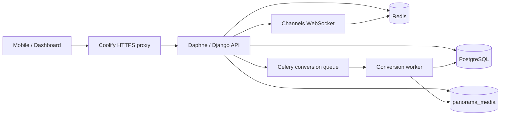

# Architecture

Owner: Backend Platform Team  
Last reviewed: 2026-07-31

## Components

Panorama is a Django/DRF API served by Daphne ASGI, with Django Channels for
WebSocket chat. PostgreSQL is the system of record. Redis is used for cache,
Channels, throttles, and Celery transport; it is not the durable record for a
security event. Celery has a normal worker, a single beat instance, and a
dedicated conversion worker. Private media is stored on a Coolify named volume.

## Application boundaries

`accounts` owns identity, OTP, sessions, roles, and capability overrides.
`universities` owns curriculum hierarchy. `files`, `chat`, `printing`,
`support`, and `verification` own their protected attachments. `lectures` owns
source lecture documents, processing states, rendered page assets, viewer
sessions, and personal notes. `audit` records security-relevant events without
secrets. `common` owns shared responses, middleware, health checks, storage,
throttles, validation, and management commands.

## Data and performance rules

List views use pagination and explicitly select required foreign keys. The
lecture list is constrained to the student curriculum and uses one joined query
plus pagination/count work; the regression test prevents a query per lecture.
New indexes on lectures support the subject/status/published list predicate,
page lookup, session lookup, and student-note page lookup. PostgreSQL
`EXPLAIN (ANALYZE, BUFFERS)` before/after measurements remain required on
staging before making a query-plan performance claim.

Redis keys retain the `panorama` prefix/version, have a TTL, and contain no raw
secrets or user-supplied sensitive identifiers. Socket timeouts and health
checks are configured so a Redis outage affects readiness rather than process
liveness.
